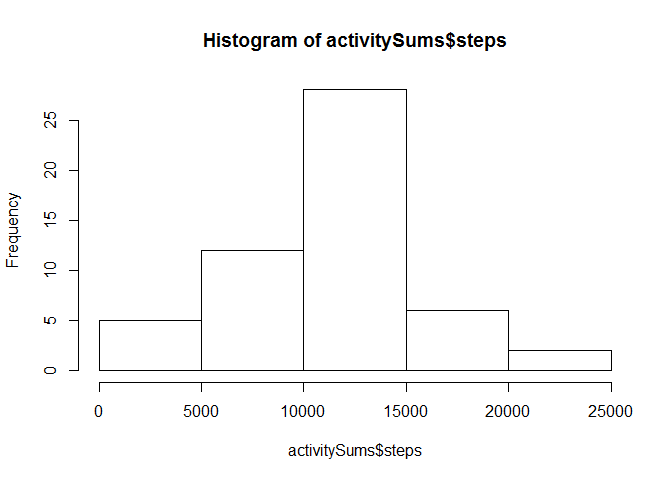
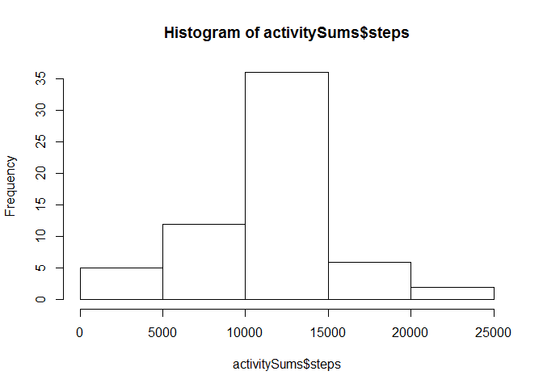
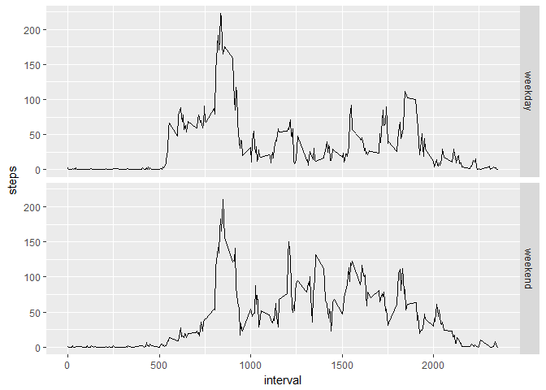

# Reproducible Research: Peer Assessment 1

## Loading and preprocessing the data

First read data from disk into data frame activityData:


```r
activityData <- read.csv("activity.csv", stringsAsFactors = FALSE)
```

Convert date string to date


```r
activityData$date <- as.POSIXct(activityData$date, format="%Y-%m-%d")
```

## What is mean total number of steps taken per day?


Calculate totals per day and plot histogram afterwards


```r
activitySums <- aggregate(steps ~ date, activityData, sum)
hist(activitySums$steps)
```

<!-- -->


Calculate and print mean and median:


```r
activityMean <- mean(activitySums$steps)
activityMedian <- median(activitySums$steps)
print(paste("Activity Mean: ",activityMean))
```

```
## [1] "Activity Mean:  10766.1886792453"
```

```r
print(paste("Activity Median:",activityMedian))
```

```
## [1] "Activity Median: 10765"
```


## What is the average daily activity pattern?

We group by intervals and use the averages across days:


```r
activityIntervals <- aggregate(steps ~ interval, activityData, mean, rm.na=TRUE)
#calculate max
activityMax <- as.character(activityIntervals[activityIntervals$steps==max(activityIntervals$steps),1])
activityString <-paste(substr(activityMax, 1, nchar(activityMax)-2), ":" ,substr(activityMax, nchar(activityMax)-1, nchar(activityMax)), sep="")

#plot it
plot(activityIntervals$interval, activityIntervals$steps, xlab="Interval", ylab="Average Steps", type="l")
```

<!-- -->

The time interval with the most average steps is 8:35.


## Imputing missing values

Count rows with NAs:


```r
nrow(activityData[is.na(activityData$steps),])
```

```
## [1] 2304
```

For missing values, the average of the others days interval should be taken as representation.


```r
ActivityDataNew <- activityData
missingValues <- activityIntervals[activityIntervals==unique(activityData[is.na(activityData$steps),]$interval),]$steps
ActivityDataNew[is.na(ActivityDataNew$steps), ]$steps= missingValues 
```


Create histogram of steps taken per day on new data. Sum up first:


```r
activitySums <- aggregate(steps ~ date, ActivityDataNew, sum)
hist(activitySums$steps)
```

<!-- -->

```r
activityMean <- mean(activitySums$steps)
activityMedian <- median(activitySums$steps)
print(paste("New Activity Mean: ",activityMean))
```

```
## [1] "New Activity Mean:  10766.1886792453"
```

```r
print(paste("New Activity Median:",activityMedian))
```

```
## [1] "New Activity Median: 10766.1886792453"
```


The median value differs from the initial data exploration. The median is now identical with the mean.


## Are there differences in activity patterns between weekdays and weekends?

Create factor vector, combine it with data frame and plot it with ggplot2:


```r
#create logical vector first
weekPartVector <- as.POSIXlt(ActivityDataNew$date)$wday >= 1 & as.POSIXlt(ActivityDataNew$date)$wday <=4

#convert to factor vector
weekPartVector <- as.factor(ifelse(weekPartVector == "FALSE", "weekend", "weekday"))

#add to data frame
ActivityDataNew <- cbind(ActivityDataNew, weekPartVector)

#aggregate/group by interval
activityIntervals <- aggregate(steps ~ interval + weekPartVector, ActivityDataNew, mean)

#using ggplot2 to plot multi facet
library(ggplot2)
p1 <- ggplot(activityIntervals, aes(x=interval, y=steps)) + geom_line()
p1 + facet_grid(weekPartVector ~ .)
```

<!-- -->


There are differences in activity patterns. On weekends there is more activity around noon.
